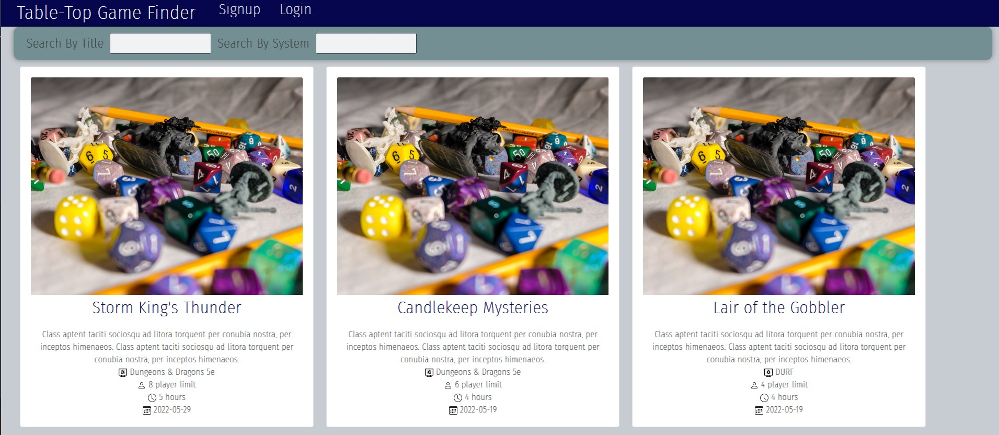

# Tabletop Group Finder

## Description

This is an online game hosting website for tabletop games. You can post games and find games. You have to have an account with our website to be part of the games.

## Table of Contents

- [Installation](#installation)

- [License](#license)

- [Screenshot](#screenshot)

- [Built With](#built-with)

- [Questions](#questions)

## Installation

To install dependencies, run the below command:

    npm i

## License

This project is licensed under the MIT license.

## Screenshot

## Built With

- React.js
- GraphQL
- Node.js
- MongoDB
- JWT authentication
- Heroku
- Bootstrap
- HTML
- Javascript
- Bootstrap

## Contributors

- Tyler
- William
- Cindy
- Karen

## Deployed Application Link

https://young-cove-50346.herokuapp.com/

## Questions

If you have questions about this repo, you can contact me at davistr1216@gmail.com. You can find more of my work on [GitHub](https://github.com/davistr)
